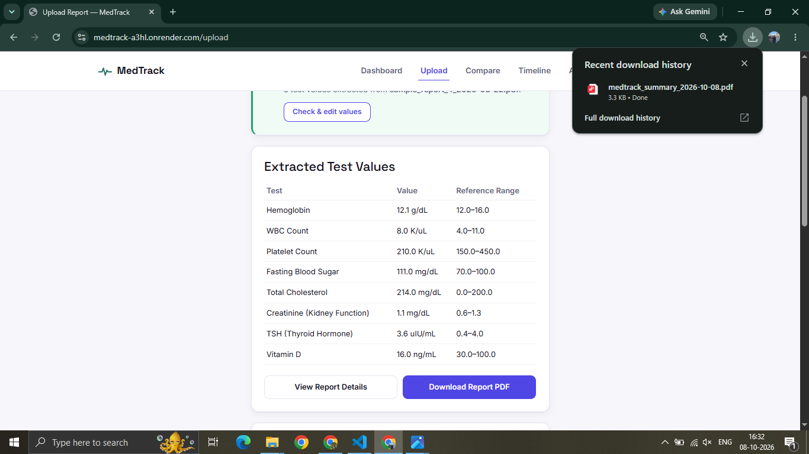

# 🩺 MedTrack

### Transforming Lab Reports into Understandable Health Insights

**MedTrack** is a web-based health report management and analysis platform developed as a Final Year Project. It helps users upload laboratory reports, automatically extract test values, understand abnormal results, track health data over time, and generate meaningful insights from their medical reports.

Instead of manually going through multiple reports and comparing values, MedTrack organizes the information into a simple dashboard with **visual trends, timelines, comparisons, health insights, and downloadable reports**.

---

## 🌐 Live Demo

🚀 **Try MedTrack:**
https://medtrack-a3hl.onrender.com/

---

## 🎯 Problem Statement

Laboratory reports contain a large amount of medical information, often presented in tables with different test names, values, units, and reference ranges.

For a user, it can be difficult to:

* Understand what each value represents
* Identify abnormal test results
* Keep track of previous reports
* Compare current and past results
* Recognize changes and trends over time
* Maintain multiple medical reports in an organized manner

MedTrack aims to make this process **simpler, faster, and more organized**.

---

## 💡 Our Solution

MedTrack converts laboratory reports into structured health data and presents the information through an easy-to-understand interface.

The application allows users to:

📄 Upload laboratory reports
🔍 Automatically extract test information
📊 Analyze test values against reference ranges
⚠️ Identify abnormal test results
📅 Maintain a health timeline
📈 Visualize test trends
🔄 Compare multiple reports
💡 Generate health insights
🎯 Track health-related goals
📑 Generate downloadable PDF summaries

---

# ✨ Key Features

## 📄 1. Automated Report Upload & Extraction

Users can upload their laboratory reports in PDF format.

MedTrack processes the report and extracts relevant information such as:

* Test name
* Test value
* Unit
* Reference range
* Report date

This reduces the need for manual data entry.

---

## 📊 2. Extracted Test Values

Extracted laboratory values are displayed in a structured format, making large and complex reports easier to understand.

Each test can be viewed along with its corresponding value, unit, and reference range.

---

## ⚠️ 3. Abnormal Test Detection

MedTrack compares extracted test values with their reference ranges.

Results are categorized to help users quickly identify tests that may require attention.

The system helps highlight:

* Normal results
* Abnormal results
* Results requiring further review

> The classification is informational and should not be considered a medical diagnosis.

---

## 📅 4. Health Timeline

All uploaded reports are organized chronologically.

The timeline allows users to view their historical reports and understand how their health data has changed over time.

---

## 📈 5. Interactive Health Trends

MedTrack visualizes laboratory values using interactive charts.

Users can track changes in selected parameters across multiple reports and identify:

* Increasing trends
* Decreasing trends
* Stable values
* Repeated abnormal results

This makes historical data much easier to interpret than reading separate reports.

---

## 💡 6. Health Insights

The application provides simplified insights based on the user's available report data.

Instead of presenting only raw numbers, MedTrack summarizes important patterns and changes in an easy-to-understand format.

---

## 🔄 7. Report Comparison

Users can compare different laboratory reports to identify changes between two time periods.

This helps users understand whether particular test values have:

* Improved
* Increased
* Decreased
* Remained relatively stable

---

## 📑 8. PDF Report Generation

MedTrack allows users to generate a structured PDF summary of their health report data.

This provides a convenient way to save or share an organized summary of the analyzed information.

---

# 🔄 How MedTrack Works

```text
        ┌──────────────────────┐
        │    User Uploads      │
        │    Lab Report PDF    │
        └──────────┬───────────┘
                   │
                   ▼
        ┌──────────────────────┐
        │    PDF Processing    │
        │   & Text Extraction  │
        └──────────┬───────────┘
                   │
                   ▼
        ┌──────────────────────┐
        │  Test Identification │
        │  & Value Extraction  │
        └──────────┬───────────┘
                   │
                   ▼
        ┌──────────────────────┐
        │ Reference Range &    │
        │ Result Classification│
        └──────────┬───────────┘
                   │
                   ▼
        ┌──────────────────────┐
        │   Database Storage   │
        └──────────┬───────────┘
                   │
                   ▼
       ┌────────────────────────┐
       │ Dashboard & Analytics  │
       ├────────────────────────┤
       │ • Abnormal Tests       │
       │ • Timeline              │
       │ • Trends                │
       │ • Comparisons           │
       │ • Health Insights       │
       │ • PDF Summary           │
       └────────────────────────┘
```

---

# 🛠️ Technology Stack

| Technology              | Purpose                         |
| ----------------------- | ------------------------------- |
| **Python**              | Core programming language       |
| **Flask**               | Web application framework       |
| **Jinja2**              | Server-side templating          |
| **HTML / CSS**          | Frontend structure and styling  |
| **Bootstrap**           | Responsive UI components        |
| **JavaScript**          | Client-side interactions        |
| **SQLite**              | Database                        |
| **SQLAlchemy**          | Database ORM                    |
| **Flask-Login**         | User authentication             |
| **pdfplumber**          | PDF text extraction             |
| **Regular Expressions** | Test/value pattern detection    |
| **Plotly**              | Interactive data visualization  |
| **ReportLab**           | PDF report generation           |
| **Anthropic API**       | AI-powered application features |
| **Render**              | Cloud deployment                |

---

# 🏗️ System Architecture

```text
                    USER
                      │
                      ▼
             ┌─────────────────┐
             │  Flask Web App  │
             └────────┬────────┘
                      │
          ┌───────────┼───────────┐
          ▼           ▼           ▼
       Upload      Dashboard   Authentication
          │
          ▼
   ┌───────────────┐
   │ PDF Processing │
   │  pdfplumber   │
   │     Regex     │
   └───────┬───────┘
           │
           ▼
   ┌────────────────┐
   │ Structured Data│
   └───────┬────────┘
           │
           ▼
   ┌────────────────┐
   │ SQLite Database│
   └───────┬────────┘
           │
           ▼
 ┌───────────────────────┐
 │ Analytics & Insights  │
 ├───────────────────────┤
 │ Trends                │
 │ Timeline              │
 │ Comparisons           │
 │ Abnormal Detection    │
 │ Health Insights       │
 └───────────┬───────────┘
             │
             ▼
       User Dashboard
```

---

# 📂 Project Structure

```text
MedTrack/
│
├── app.py
├── requirements.txt
├── README.md
│
├── templates/
│   ├── base.html
│   ├── index.html
│   ├── login.html
│   ├── register.html
│   ├── dashboard.html
│   ├── upload.html
│   └── ...
│
├── static/
│   ├── css/
│   ├── js/
│   └── images/
│
├── screenshots/
│   ├── home.png
│   ├── dashboard.png
│   ├── upload.png
│   ├── extracted-values.png
│   ├── abnormal-tests.png
│   ├── timeline.png
│   ├── trends.png
│   ├── health-insights.png
│   ├── compare.png
│   └── pdf-report.png
│
└── instance/
    └── database.sqlite
```

---

# 🚀 Getting Started

## 1. Clone the Repository

```bash
git clone <YOUR_GITHUB_REPOSITORY_URL>
cd MedTrack
```

## 2. Create a Virtual Environment

### Windows

```bash
python -m venv venv
venv\Scripts\activate
```

### macOS / Linux

```bash
python3 -m venv venv
source venv/bin/activate
```

## 3. Install Dependencies

```bash
pip install -r requirements.txt
```

## 4. Configure Environment Variables

Create a `.env` file and add the required environment variables.

```env
SECRET_KEY=your_secret_key
ANTHROPIC_API_KEY=your_api_key
```

**Never commit API keys or other secrets to GitHub.**

## 5. Run the Application

```bash
python app.py
```

Open:

```text
http://127.0.0.1:5000/
```

---

# 🔍 Report Processing Pipeline

MedTrack processes reports through multiple stages:

### 1. Upload

The user uploads a laboratory report in PDF format.

### 2. Text Extraction

The application extracts readable text from the uploaded document using PDF processing tools.

### 3. Test Detection

Patterns and matching rules are used to identify laboratory test names and their associated values.

### 4. Reference Range Detection

The system identifies the reference range associated with the test whenever available.

### 5. Result Classification

The extracted value is evaluated against the available reference range.

### 6. Data Storage

The structured information is stored in the database and linked to the user's report.

### 7. Analytics

Historical results are used to generate timelines, comparisons, trends, and health insights.

---

# 📸 Application Screenshots

## 🏠 Home Page


The landing page introduces MedTrack and explains how the platform converts laboratory reports into useful health information.

---

## 📊 Dashboard


The dashboard provides a centralized overview of the user's reports and health-related information.

---

## 📤 Upload Report


Users can upload their laboratory report PDFs for automatic processing and analysis.

---

## 🔍 Extracted Values



Extracted laboratory tests are presented in a structured and readable format.

---

## ⚠️ Abnormal Tests


Potentially abnormal results are highlighted by comparing test values with their corresponding reference ranges.

---

## 📅 Health Timeline


The timeline organizes uploaded reports chronologically, allowing users to view their health data over time.

---

## 📈 Health Trends


Interactive charts help users visualize changes in laboratory values across multiple reports.

---

## 💡 Health Insights


MedTrack presents simplified insights based on the available health data.

---

## 🔄 Report Comparison


Users can compare reports from different dates to identify changes in their laboratory results.

---

## 📑 Generated PDF Report


Users can generate a structured PDF summary containing important report information and analysis.

---

# 🔐 Security & Privacy

MedTrack uses account-based authentication to associate uploaded reports and health information with individual users.

The application follows practices such as:

* Password authentication
* Session-based access control
* User-specific report access
* Secure file handling
* Environment variables for sensitive credentials

However, this project is primarily developed for **academic and demonstration purposes** and should not be considered a production-grade electronic medical records system.

---

# ⚠️ Limitations

* The current system works best with **digital/text-based PDF laboratory reports**.
* Different laboratories may use different report formats and reference ranges.
* Some reports may contain layouts that are difficult to parse automatically.
* Automated classification should not be treated as a medical diagnosis.
* AI-generated or automated insights may require verification.
* Medical decisions should always be made by a qualified healthcare professional.

---

# 🔮 Future Scope

MedTrack can be further enhanced with:

* 📱 Dedicated Android/iOS application
* 🧠 More advanced AI-assisted report explanations
* 🔔 Personalized health alerts
* 💊 Medication tracking
* 📅 Doctor appointment management
* 🏥 Healthcare provider integration
* 🌐 Multi-language support
* 📊 Advanced predictive analytics
* ☁️ Secure cloud-based medical document storage
* 🔐 Enhanced encryption and healthcare-grade security

---

# 🎓 Project Objective

The primary objective of MedTrack is to create a simple and accessible platform that transforms complex laboratory reports into **structured, trackable, and understandable health information**.

The project combines **web development, database management, PDF processing, data visualization, and AI-assisted features** into one integrated healthcare application.

---

# 👥 Team

**MedTrack — Final Year Project**

Developed as an academic project with the goal of improving how users organize and understand their laboratory report data.

---

# ⚕️ Medical Disclaimer

MedTrack is an **educational and informational software application**.

It does not diagnose diseases, prescribe medicines, recommend treatments, or replace professional medical advice.

Users should consult a qualified healthcare professional before making any healthcare decisions based on laboratory results.

---

## ⭐ MedTrack

> **Don't just store your reports. Understand your health journey.**
